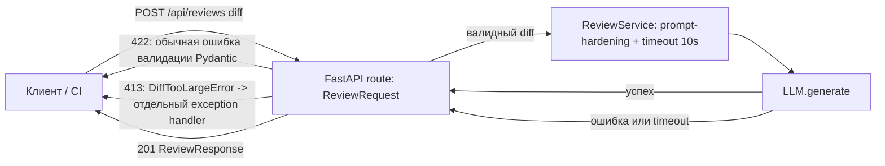

# ADR: решение для первого рабочего сценария

- Статус: proposed
- Дата: 2026-09-07
- Ответственные: X_xp

## Контекст

Эндпоинт `POST /api/reviews` в текущем виде принимает произвольный `dict`, не валидирует вход, не ограничивает размер `diff`, не обрабатывает ошибки LLM-вызова и не имеет объявленной схемы ответа (см. [`problem.md`](problem.md), [`context.md`](context.md), результат P1-02 в [`prompts.md`](prompts.md)). Нужно решение, которое минимально меняет сервис, но закрывает риски необработанных 500, неограниченных затрат на LLM и утечки секретов через prompt, не выходя за рамки роли сервиса как советующего ассистента (`SCOPE-1`).

## Решение

Ввести Pydantic-модели `ReviewRequest`/`ReviewResponse` на границе API (`app/api.py`): отсутствие или неверный тип поля `diff` даёт стандартную Pydantic-ошибку валидации → FastAPI сам вернёт 422 (`RequestValidationError`). Лимит размера `diff` (`API-1`, 20 000 символов) — это **отдельный, а не автоматический** механизм: обычная Pydantic-валидация по умолчанию тоже дала бы 422, а не 413. Поэтому проверка длины поднимает собственное исключение `DiffTooLargeError` (в `field_validator`, вне стандартных `ValueError`/`TypeError`/`AssertionError`, которые Pydantic перехватывает сам), а отдельный `@app.exception_handler(DiffTooLargeError)` в `app/api.py` явно превращает его в HTTP 413. `try/except` и timeout 10 секунд вокруг вызова `llm.generate` в `ReviewService` (`REL-1`), и шаблон промпта с явным разделением system/user частей и редактированием секретов перед отправкой (`SEC-1`). Ответственность разделена по границе: FastAPI-слой отвечает за контракт и статус-коды (включая отдельный exception handler для 413), `ReviewService` — за таймауты, харднинг промпта и устойчивость к сбоям LLM.

## Дополнительное решение: асинхронный вызов LLM

Нагрузочный сценарий «Пиковая нагрузка CI» ([`tests_load.md`](tests_load.md)) держит 20 RPS при латентности до 12с на запрос — это означает до `20 × 12 = 240` одновременных запросов в системе в пике. Дефолтный threadpool FastAPI/Starlette для синхронных route-обработчиков — 40 потоков (лимитер `anyio`). Если `ReviewService.review` остаётся синхронной функцией, выполняемой в этом пуле, сервис физически не может обслужить больше ~40 запросов одновременно (реальный предел RPS при латентности 12с — около `40 / 12 ≈ 3.3` RPS), и нагрузочный тест будет падать даже на полностью исправном сервисе — это ложноположительный сбой, а не сигнал о регрессии.

Это ровно тот риск, который `P1_01.txt` (zero-shot, P1-01) уже называл («The handler is sync and calls a potentially slow I/O-bound operation... long-running calls can tie up worker threads»), но ADR его не учитывал. Исправление: `ReviewService.review` должен быть `async def` и вызывать LLM через асинхронный клиент (например, `httpx.AsyncClient`), а не через блокирующий вызов в синхронном потоке. Это не то же самое, что отклонённая выше альтернатива «асинхронная очередь/воркер» — там речь про отдельную инфраструктуру, здесь — про то, чтобы I/O-bound вызов не занимал поток из ограниченного пула, а не про дополнительный сервис.

## Рассмотренные альтернативы

| Альтернатива | Почему не выбрали сейчас |
|---|---|
| Ручная валидация внутри route без Pydantic | Дублирует то, что FastAPI даёт бесплатно; не даёт OpenAPI-схему клиентам; сложнее поддерживать по мере роста контракта |
| Асинхронная очередь/воркер для LLM-вызова | Реальный объём трафика ещё не измерен (`problem.md`, метрика «недельный объём запросов» — «собираем метрику»), поэтому нет подтверждённой необходимости в отдельной инфраструктуре очереди прямо сейчас; пересмотреть, когда эта метрика покажет устойчивый рост, а не на основании предположения, что нагрузка низкая |
| Отдельный прокси-сервис для санитизации diff перед `ReviewService` | Больше движущихся частей ради задачи, которую решает одна функция редактирования секретов внутри существующего сервиса |

## Последствия и главный риск

- Положительные последствия: 5xx остаются только для реально неожиданных сбоев; клиенты получают предсказуемый контракт и понятные статусы ошибок; расходы на LLM ограничены лимитом размера входа.
- Ограничения: решение сознательно не покрывает аутентификацию и rate limiting (см. «Что не входит в задачу» в [`problem.md`](problem.md)).
- Главный риск: порог в 20 000 символов может оказаться слишком жёстким для реальных PR и отклонять легитимные diff.
- Как проверим риск: метрика «доля отклонённых из-за лимита» из [`problem.md`](problem.md); порог пересматривается, если доля отклонений превышает 5%.

## Архитектурная схема

## Как использовали AI

- Для чего: собрать архитектурное решение из подтверждённых рисков P1-02, не добавляя ничего сверх Context Pack.
- Тип промпта: master prompt.
- Строка в [`prompts.md`](prompts.md): P1-02.
- Что проверили и исправили сами: сопоставили каждый пункт решения с конкретным правилом (`SEC-1`/`API-1`/`REL-1`) и с конкретной строкой diff, а не только с общими best practices. После peer review (PR #37, ревьюер Kulakva20062) исправили техническую неточность: Pydantic сам по себе не может вернуть 413 (только 422), поэтому в решение добавлен явный механизм — кастомное исключение `DiffTooLargeError` + отдельный `exception_handler`.
